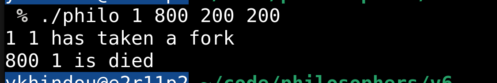
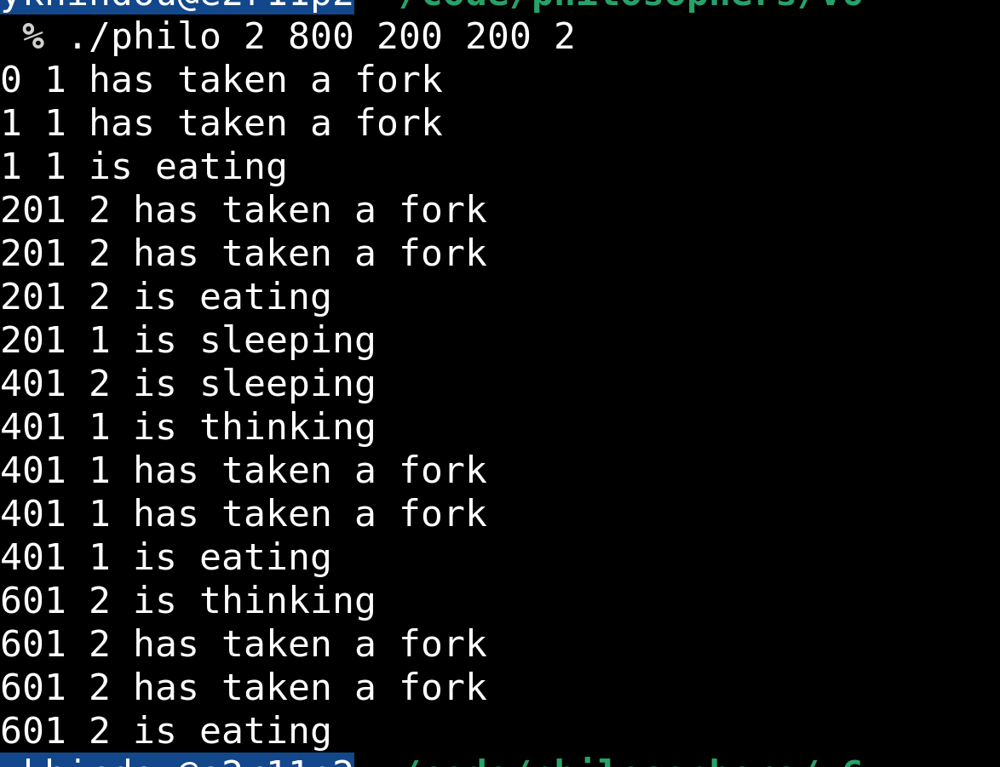
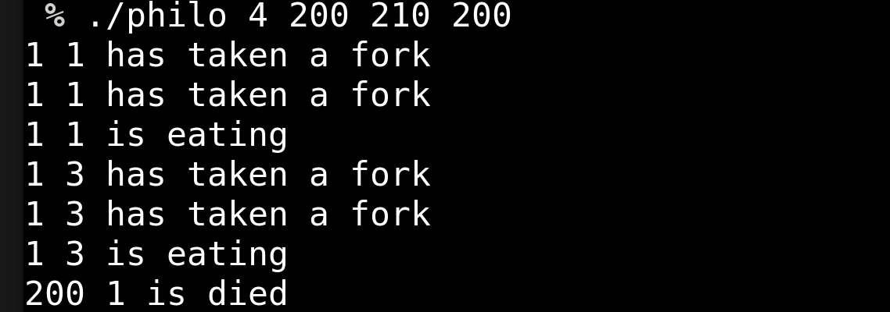

# 42 Philosophers (Dining Philosophers Problem)

## 🚀 Project Summary

The Dining Philosophers problem is a well-known synchronization challenge involving multiple philosophers sitting around a table. Each philosopher alternates between thinking, eating, and sleeping, but must pick up two forks (shared resources) to eat. This project requires managing threads and mutexes to ensure that philosophers do not die from starvation and that the simulation behaves correctly under tight timing constraints.

## 🎯 Purpose

- Learn and practice **thread synchronization** using `pthread_mutex`
- Understand and avoid common concurrency problems like **deadlocks**, **race conditions**, and **starvation**
- Handle precise **time measurement** and **thread management**
- Build robust and leak-free C code with clean architecture

## 🔧 Key Concepts

- **POSIX threads (pthreads)**
- **Mutexes** for managing access to shared resources (forks)
- **Time management** using `gettimeofday` and `usleep`
- **Thread lifecycle** management and proper exit handling
- Optional **bonus version** using **processes** and **semaphores**

## ⚙️ How to Compile

make
    This will create an executable named philo.
    
## ▶️ How to Run

./philo number_of_philosophers time_to_die time_to_eat time_to_sleep [number_of_times_each_philosopher_must_eat]

    number_of_philosophers: Number of philosophers and forks

    time_to_die: Time (in ms) before a philosopher dies without eating

    time_to_eat: Time (in ms) a philosopher spends eating

    time_to_sleep: Time (in ms) a philosopher spends sleeping

    number_of_times_each_philosopher_must_eat: (optional) Ends simulation when each philosopher has eaten this many times

## 🧪 Example

./philo 5 800 200 200

## 🧠 Learning Outcomes

    Deep understanding of concurrent programming

    Hands-on experience with mutexes, critical sections, and race conditions

    Improved debugging and problem-solving skills in multithreaded C programs 

## 42 Project Guidelines

    Must follow strict coding rules (no for, no ternary operator, limited external functions)

    Must handle all edge cases and errors gracefully

    Memory leaks and undefined behavior are not allowed

## 📸 Screenshots

   ### Test 1

   ### Test 2

   ### Test 3

